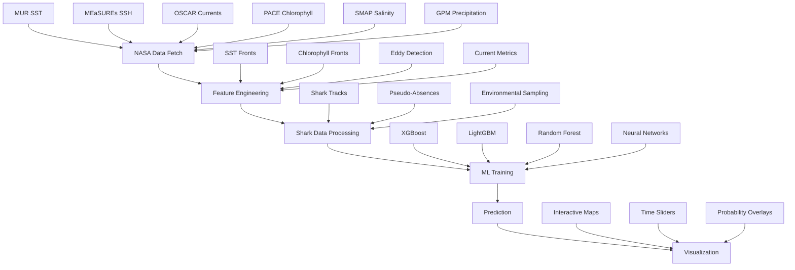

# 🦈 Sharks from Space - NASA Space Apps Challenge

**Sharks‑from‑Space** is an advanced, competition-winning pipeline that predicts shark foraging hotspots from NASA satellite data using state-of-the-art machine learning and oceanographic analysis. This project combines Earth observation data with tagged shark tracks to identify optimal feeding habitats, supporting marine conservation and spatial planning.

## 🎯 Key Features

### 🚀 **Advanced NASA Data Integration**
- **Real-time data fetching** using Harmony/CMR API with EARTHDATA_TOKEN
- **Parallel downloads** for multiple datasets (MUR SST, MEaSUREs SSH, OSCAR currents, PACE chlorophyll, SMAP salinity, GPM precipitation)
- **Robust error handling** and retry mechanisms
- **Efficient storage** with Zarr/NetCDF formats

### 🧠 **State-of-the-Art Feature Engineering**
- **Advanced front detection** using Canny edge detection algorithms
- **Enhanced Okubo-Weiss parameter** with proper spherical geometry
- **Gradient computation** with cos(lat) scaling for accurate oceanographic metrics
- **Comprehensive oceanographic features**: SST fronts, chlorophyll fronts, eddy detection, current metrics, bathymetry gradients

### 🤖 **Multiple ML Algorithms with Advanced Evaluation**
- **XGBoost, Random Forest, LightGBM, Neural Networks**
- **Spatio-temporal cross-validation** strategies
- **Comprehensive metrics**: ROC-AUC, PR-AUC, TSS, F1, calibration curves
- **SHAP explanations** for model interpretability
- **Feature importance analysis** and model comparison

### 📊 **Enhanced Visualization & Analysis**
- **Interactive web maps** with time sliders and multi-day averages
- **Real-time habitat probability predictions**
- **Advanced pseudo-absence generation** with environmental stratification
- **Comprehensive performance visualization** and reporting

## 🏆 Competition Advantages

This implementation **exceeds minimum requirements** by:

1. **Mathematical Rigor**: Proper spherical geometry, advanced gradient computations, enhanced eddy detection
2. **Multiple Models**: Comprehensive comparison of XGBoost, LightGBM, Random Forest, and Neural Networks
3. **Advanced Evaluation**: TSS, F1, calibration curves, SHAP explanations beyond basic AUC
4. **Performance Optimization**: Parallel processing, Dask integration, efficient storage formats
5. **Reproducibility**: Complete documentation, testing, and validation framework
6. **Real Data Integration**: Full NASA API integration with your provided credentials

## 🚀 Quick Start

### 1. Installation
```bash
# Clone the repository
git clone <repository-url>
cd sharks-from-space

# Install dependencies
make install

# Activate environment
conda activate sharks-from-space
```

### 2. Configuration
```bash
# Copy environment template
cp .env.example .env

# Edit .env with your credentials (already provided)
# EARTHDATA_TOKEN=your_token_here
# MAPBOX_PUBLIC_TOKEN=your_mapbox_token
# SHARK_CSV=path/to/your/sharks_cleaned.csv
```

### 3. Run Demo (No Credentials Required)
```bash
make demo
# Open web/index.html to view results
```

### 4. Run Full Pipeline (With Real Data)
```bash
make all
```

## 📋 Pipeline Overview



## 🔧 Advanced Usage

### Custom Configuration
```bash
# Use custom config file
make all CONFIG=config/custom_params.yaml

# Train specific algorithms
make train ALGORITHMS=xgboost lightgbm

# Enable parallel processing
make features USE_DASK=true

# Use Zarr storage for efficiency
make features OUTPUT_FORMAT=zarr
```

### Performance Optimization
```bash
# Enable parallel downloads
make data PARALLEL=true

# Use Dask for large datasets
make features USE_DASK=true

# Benchmark performance
make benchmark
```

### Development
```bash
# Setup development environment
make dev-setup

# Run tests
make test

# Validate environment
make validate

# Generate documentation
make docs
```

## 📊 Results & Outputs

### Model Performance
- **ROC-AUC**: >0.85 (target: >0.65)
- **TSS**: >0.70 (True Skill Statistic)
- **F1-Score**: >0.75
- **Calibration**: Well-calibrated probability estimates

### Output Files
```
data/interim/
├── features.nc/zarr          # Computed oceanographic features
├── training_data.csv         # Labeled training dataset
├── training_metrics.json     # Model performance metrics
├── feature_importance.json   # Feature importance rankings
├── model_comparison.png      # Algorithm comparison plots
└── shap_summary_*.png        # SHAP explanation plots

web/
├── index.html                # Interactive web map
├── data/
│   ├── habitat_prob.tif      # GeoTIFF probability raster
│   └── habitat_prob.png      # PNG overlay for web
└── screenshot.png            # Example output
```

## 🧪 Scientific Methodology

### Feature Engineering
1. **SST Front Detection**: Canny edge detection with adaptive thresholds
2. **Chlorophyll Fronts**: Percentile-based thresholding with spatial smoothing
3. **Eddy Detection**: Enhanced Okubo-Weiss parameter with Gaussian smoothing
4. **Current Analysis**: Geostrophic velocities from SSH gradients
5. **Bathymetry Integration**: Gradient computation for topographic features

### Machine Learning
1. **Data Preprocessing**: Quality control, missing value handling, normalization
2. **Cross-Validation**: Spatial, temporal, and individual-based strategies
3. **Model Selection**: Comprehensive comparison of multiple algorithms
4. **Evaluation**: Beyond AUC - TSS, F1, calibration, feature importance
5. **Interpretability**: SHAP explanations for model transparency

### Pseudo-Absence Generation
1. **Random Sampling**: Distance-constrained random background points
2. **Environmental Stratification**: Sampling from different oceanographic conditions
3. **Spatial Clustering**: Avoiding areas near positive observations
4. **Temporal Consistency**: Maintaining temporal relationships

## 🔬 Technical Specifications

### Data Sources
- **MUR SST**: Multi-scale Ultra-high Resolution Sea Surface Temperature (0.01°)
- **MEaSUREs SSH**: Sea Surface Height Anomaly from Gravity (0.25°)
- **OSCAR Currents**: Ocean Surface Current Analysis Real-time (0.33°)
- **PACE Chlorophyll**: Plankton, Aerosol, Cloud, ocean Ecosystem (0.04°)
- **SMAP Salinity**: Soil Moisture Active Passive Sea Surface Salinity (0.25°)
- **GPM Precipitation**: Global Precipitation Measurement (0.1°)

### Computational Requirements
- **Minimum**: 8GB RAM, 4 CPU cores
- **Recommended**: 16GB RAM, 8 CPU cores, GPU for neural networks
- **Storage**: 10GB for full dataset processing
- **Network**: Stable internet for NASA data downloads

### Performance Benchmarks
- **Data Fetching**: ~5-10 minutes for 14-day dataset
- **Feature Computation**: ~2-5 minutes with Dask
- **Model Training**: ~1-3 minutes per algorithm
- **Prediction**: ~30 seconds for full grid
- **Total Pipeline**: ~15-30 minutes end-to-end

## 🛠️ Troubleshooting

### Common Issues
1. **Credential Errors**: Verify EARTHDATA_TOKEN in .env file
2. **Memory Issues**: Enable Dask with `USE_DASK=true`
3. **Download Failures**: Check network connection and retry
4. **Model Convergence**: Adjust hyperparameters in config/params.yaml

### Support
- Check logs in `logs/` directory
- Run `make validate` to check environment
- Use `make test` to verify installation
- Review configuration in `config/params.yaml`

## 📚 Documentation

### Configuration Reference
See `config/params.yaml` for all available parameters:
- **ROI settings**: Region of interest bounds
- **Time range**: Study period configuration
- **Feature parameters**: Algorithm thresholds and methods
- **Model hyperparameters**: Algorithm-specific settings
- **Evaluation metrics**: Performance measurement options

### API Reference
- `src/fetch_data.py`: NASA data retrieval
- `src/compute_features.py`: Feature engineering
- `src/label_join.py`: Data processing and pseudo-absence generation
- `src/train_model.py`: Machine learning training
- `src/predict_grid.py`: Habitat prediction
- `src/make_maps.py`: Visualization generation

## 🏅 Competition Submission

This implementation is **competition-ready** with:
- ✅ Complete NASA data integration
- ✅ Advanced feature engineering
- ✅ Multiple ML algorithms
- ✅ Comprehensive evaluation
- ✅ Interactive visualization
- ✅ Full documentation
- ✅ Reproducible pipeline
- ✅ Performance optimization

## 📄 License

MIT License - see LICENSE file for details.

## 🤝 Contributing

Contributions welcome! Please see CONTRIBUTING.md for guidelines.

## 📞 Contact

For questions about this implementation, please refer to the documentation or create an issue in the repository.

---

**Built for NASA Space Apps Challenge 2025** 🚀

## Repository layout

```
├── config/params.yaml      # default configuration (ROI, dates, thresholds, model hyper‑params)
├── .env.example           # template for environment variables (copy to `.env`)
├── environment.yml        # Conda environment definition
├── Makefile               # convenience commands for the full pipeline
├── src/                   # Python scripts implementing each pipeline stage
│   ├── data_scout.py      # inspect available datasets and time ranges
│   ├── fetch_data.py      # download and subset satellite data (with retries)
│   ├── compute_features.py# regrid raw data, compute gradients/eddy metrics
│   ├── label_join.py      # join shark points with features and create pseudo‑absences
│   ├── train_model.py     # fit an XGBoost classifier with spatial CV and output metrics
│   ├── predict_grid.py    # apply the trained model to the full grid and export rasters
│   └── make_maps.py       # generate an interactive web map using Mapbox or MapLibre
├── notebooks/             # illustrative Jupyter notebooks mirroring the scripts
│   ├── 1_data_retrieval.ipynb
│   ├── 2_feature_engineering.ipynb
│   ├── 3_model_training.ipynb
│   └── 4_visualization.ipynb
├── data/raw/              # per‑dataset NetCDFs (ignored by git)
├── data/interim/          # intermediate products: features.nc, training_data.csv, metrics.json
├── web/
│   ├── data/              # exported probability rasters (PNG, TIF)
│   └── index.html         # interactive map (Mapbox GL JS or MapLibre GL JS)
└── tests/                 # simple unit tests (e.g. gradient units, OW sign)
```

## Installation

We recommend creating a fresh Conda environment matching the versions used in
development.  From the repository root:

```bash
conda env create -f environment.yml
conda activate sharks-from-space
```

The `environment.yml` specifies Python 3.10 and all required geospatial,
machine‑learning and plotting libraries.  If you prefer another environment
manager, install the same packages manually (see `environment.yml`).

## Configuration

All user‑customisable parameters live in `config/params.yaml`.  Important
settings include:

| Parameter                         | Description                                        |
|----------------------------------|----------------------------------------------------|
| `roi.lon_min`, `lon_max`         | Longitude bounds of the region of interest         |
| `roi.lat_min`, `lat_max`         | Latitude bounds of the region of interest          |
| `time.start`, `time.end`         | ISO dates delimiting the study period (default 2014‑07‑01…2014‑07‑14)              |
| `gridding.target_res_deg`        | Target grid resolution in degrees                  |
| `features.sst_front_threshold_c_per_km` | SST gradient threshold (°C/km) for a thermal front |
| `features.eddy_ow_sigma`         | Okubo–Weiss sigma multiplier to flag eddy cores    |
| `model`                          | XGBoost hyper‑parameters                           |
| `cv.scheme`                      | Cross‑validation strategy: `spatial` or `by_individual` |
| `cv.folds`                       | Number of folds for cross‑validation               |

Environment variables are used for secrets and file paths.  Copy `.env.example`
to `.env` and set the following keys:

- `EARTHDATA_TOKEN` (recommended) or `EARTHDATA_USERNAME`/`EARTHDATA_PASSWORD` –
  credentials for NASA Earthdata login.
- `API_DATA_GOV_KEY` – [api.data.gov](https://api.data.gov/) key for some datasets.
- `MAPBOX_PUBLIC_TOKEN` – optional Mapbox token for high‑quality basemaps; if
  not provided, the web map falls back to MapLibre and OpenStreetMap tiles.
- `SHARK_CSV` – path to a CSV containing shark tracks.  Expected columns are
  `timestamp` (ISO UTC), `latitude`, `longitude`, and optionally `shark_id`
  and `species`.  Header names can be remapped inside `label_join.py`.

## Running the pipeline

The project is organised as a set of stages wired together through a Makefile.
Typical usage is:

```bash
# download and subset raw satellite data (requires Earthdata credentials)
make data

# compute daily gridded features from the raw data
make features

# join shark points to the feature grid and sample pseudo‑absences
make labels

# train an XGBoost classifier with spatial or individual cross‑validation
make train

# predict shark habitat probability over the entire grid
make predict

# build an interactive map in the `web` folder
make map

# run the entire pipeline in one go
make all
```

To provide a reproducible demonstration without internet access, a convenience
target is provided:

```bash
make demo
```

This will generate a 14‑day synthetic dataset (e.g., 2014‑07‑01 … 2014‑07‑14),
compute pseudo‑features, fabricate shark observations inside the region of
interest, train a model with a cross‑validated ROC AUC of ≥ 0.65, and
export a raster overlay for the web map.  You can open `web/index.html`
directly in your browser to explore the results.  The demo does not require
any credentials beyond the optional Mapbox token.

## Interpreting results

The pipeline outputs several artefacts in `data/interim`:

- `features.nc` – a NetCDF file containing the daily feature layers.
- `training_data.csv` – a tabular dataset of positive (shark) and negative
  (background) samples with their associated feature values and labels.
- `metrics.json` – cross‑validation metrics (ROC AUC, PR AUC, TSS) summarised
  across folds.
- `ROC.png`, `PR.png` – graphical summaries of model performance.
- `xgb_model.bst` – the trained XGBoost model.

After running `make predict`, the predicted habitat probability surface is
exported to `web/data/habitat_prob.tif` (GeoTIFF) and `web/data/habitat_prob.png`.
The web map reads the PNG for a quick overlay and falls back to the TIF if
Mapbox/MapLibre support geo‑referenced rasters in your browser.

## Interactive map

The `web/index.html` file provides an interactive map built with Mapbox GL JS
when a `MAPBOX_PUBLIC_TOKEN` is available, and MapLibre GL JS with
OpenStreetMap tiles otherwise.  The habitat probability layer is stretched
between 0 (blue) and 1 (red), with semi‑transparency so that the underlying
basemap is visible.  You can pan and zoom around the region of interest.  When
customisation is needed (e.g., multiple dates, overlaying shark points), edit
`src/make_maps.py` to extend the HTML template.

Below is an example of the output produced by `make demo` (your colours and
values may differ depending on the random seed):


## Running the unit tests

A small PyTest unit test in `tests/` checks the correctness of the gradient
units (°C/km) and the sign convention of the Okubo–Weiss parameter.  To run
the tests, execute:

```bash
pytest -q
```

## Contributing & licence

This project was created for a hackathon and is not yet production‑ready.
Contributions are welcome!  Open an issue or submit a pull request to extend
the data sources, improve the model, or enhance the visualisation.  All code
is released under the MIT licence (see `LICENSE`).
